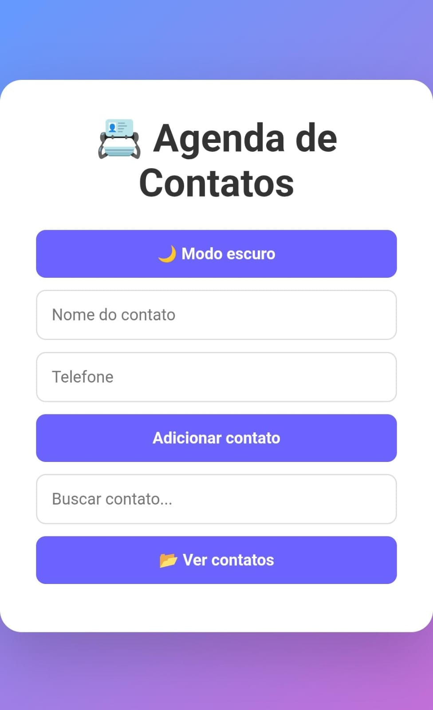

# 📇 Buscador de Contatos

Aplicação web desenvolvida para **gerenciar contatos de forma simples e rápida**.
O usuário pode adicionar, editar, buscar e remover contatos diretamente no navegador.

Os dados são armazenados no **LocalStorage**, permitindo que os contatos permaneçam salvos mesmo após atualizar ou fechar a página.

---

# 🚀 Demonstração

🔗 Acesse o projeto online:
https://cassymari.github.io/Buscador-de-contato/

---

# 📸 Preview do projeto



---


---

## 🚀 Funcionalidades

* ➕ Adicionar novos contatos
* 🔍 Buscar contatos pelo nome
* ✏️ Editar contatos existentes
* ❌ Remover contatos
* 👤 Avatar automático com a inicial do nome
* 📂 Mostrar / esconder lista de contatos
* 💾 Persistência de dados com LocalStorage

---

## 🛠️ Tecnologias utilizadas

* **HTML5**
* **CSS3**
* **JavaScript**
* **LocalStorage API**

---

## 📂 Estrutura do projeto

```
Buscador-de-contato
│
├── index.html
├── style.css
├── scripts.js
└── README.md
```

---

## ▶️ Como executar o projeto

1. Clone este repositório:

```
git clone https://github.com/cassymari/Buscador-de-contato.git
```

2. Acesse a pasta do projeto:

```
cd Buscador-de-contato
```

3. Abra o arquivo **index.html** no navegador.

---

## 💻 Demonstração

Interface simples e moderna para gerenciamento de contatos, permitindo organizar informações rapidamente sem necessidade de banco de dados externo.

---

## 📚 Aprendizados

Durante o desenvolvimento deste projeto foram praticados conceitos importantes como:

* Manipulação do **DOM**
* Uso de **eventos em JavaScript**
* Estruturação de funções
* Uso do **LocalStorage**
* Organização de código front-end

---

## 👩‍💻 Autora

Projeto desenvolvido por **Cassy Maria**

🔗 GitHub: https://github.com/cassymari<br>
🔗 LinkedIn: https://www.linkedin.com/in/cassiane-m-nascimento/
